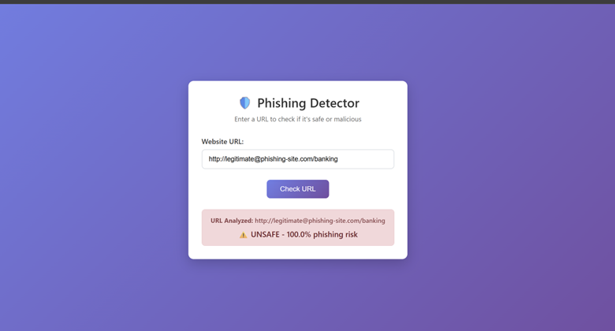
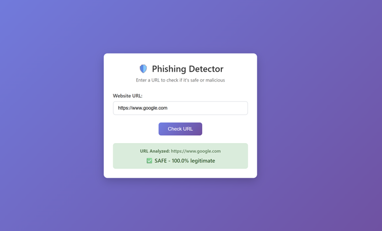

# 🛡️ Phishing URL Detection System

An intelligent machine learning-based system to detect phishing websites in real-time using advanced feature engineering and ensemble classification techniques.


## 🖼️ Application Demo

### Phishing URL Detection (UNSAFE)

<div align="center">
  
  <br>
  <em>Detection of malicious website - Classified as 100% Phishing Risk</em>
</div>

### Legitimate URL Detection (SAFE)

<div align="center">
  
  <br>
  <em>Detection of legitimate website (Google.com) - Classified as 100% Safe</em>
</div>

## 📋 Table of Contents

- [Overview](#-overview)
- [Key Features](#-key-features)
- [Technology Stack](#-technology-stack)
- [Installation](#-installation)
- [Usage](#-usage)
- [Model Performance](#-model-performance)
- [Project Structure](#-project-structure)
- [API Reference](#-api-reference)
- [Contributing](#-contributing)

## 🎯 Overview

This project implements a comprehensive phishing detection system that analyzes URLs and classifies them as legitimate or malicious. The system uses machine learning algorithms trained on **30+ engineered features** extracted from URLs to provide real-time threat assessment.

### 🔬 Research Highlights

- **Dataset**: 11,054 URLs (balanced: 50% phishing, 50% legitimate)
- **Feature Engineering**: 30+ carefully crafted features for URL analysis
- **Model Comparison**: Scientific evaluation of 3 ML algorithms
- **Real-time Processing**: Sub-second prediction capabilities
- **Web Interface**: User-friendly Flask-based application

## ✨ Key Features

### 🔍 Advanced Feature Extraction

- **URL Structure Analysis**: Length, complexity, suspicious patterns
- **Domain Intelligence**: IP detection, subdomain analysis, TLD validation
- **Security Indicators**: HTTPS usage, certificate validation
- **Content Analysis**: Suspicious keywords, redirect detection
- **Statistical Features**: Character distributions, entropy analysis

### 🤖 Machine Learning Models

1. **Decision Tree Classifier**

   - Rule-based interpretable decisions
   - Visual decision path representation
   - High explainability for security teams

2. **Naive Bayes (Gaussian)**

   - Probabilistic classification
   - Fast training and prediction
   - Robust to feature scaling

3. **Logistic Regression**
   - Statistical approach with sigmoid activation
   - Feature importance analysis
   - Balanced performance and interpretability

### 🌐 Web Application Features

- **Real-time URL Analysis**: Instant threat assessment
- **Confidence Scoring**: Probability-based risk evaluation
- **URL Preservation**: Input field maintains URL after analysis
- **Responsive Design**: Mobile-friendly interface
- **Error Handling**: Graceful handling of invalid URLs

## 🛠️ Technology Stack

| Component           | Technology                  | Purpose                                |
| ------------------- | --------------------------- | -------------------------------------- |
| **Backend**         | Python 3.8+, Flask          | Web framework and API                  |
| **ML/AI**           | scikit-learn, NumPy, Pandas | Machine learning and data processing   |
| **Visualization**   | Matplotlib, Seaborn         | Model analysis and performance metrics |
| **Frontend**        | HTML5, CSS3, JavaScript     | User interface                         |
| **Data Processing** | BeautifulSoup, requests     | Web scraping and URL analysis          |
| **Development**     | Jupyter Notebooks           | Model development and experimentation  |

## 📦 Installation

### Prerequisites

```bash
Python 3.8 or higher
pip package manager
Git
```

### Quick Start

1. **Clone the repository**

```bash
git clone https://github.com/yourusername/phishing-url-detection.git
cd phishing-url-detection
```

2. **Create virtual environment**

```bash
python -m venv venv

# On Windows
venv\Scripts\activate

# On macOS/Linux
source venv/bin/activate
```

3. **Install dependencies**

```bash
pip install -r requirements.txt
```

4. **Train the models** (Optional - pre-trained models included)

```bash
jupyter notebook notebooks/model_training.ipynb
# Run all cells to train and compare models
```

5. **Run the application**

```bash
cd src
python app.py
```

6. **Access the application**
   - Open your browser and navigate to `http://localhost:5000`
   - Enter a URL to test the phishing detection system

## 🚀 Usage

### Web Interface

1. **URL Input**: Enter any URL in the input field
2. **Analysis**: Click "Check URL" button
3. **Results**: View prediction with confidence score and analyzed URL
4. **Testing**: Use the provided test URLs for validation

### Sample Test URLs

**Legitimate URLs** (Should show as SAFE):

```
https://www.google.com
https://github.com
https://www.microsoft.com
```

**Phishing URLs** (Should show as UNSAFE):

```
http://192.168.1.100/secure-login
http://paypal-verification.net
http://legitimate@phishing-site.com
```

### API Usage

```python
from src.feature import FeatureExtraction
import pickle

# Load trained model
with open('notebooks/model/model.pkl', 'rb') as f:
    model = pickle.load(f)

# Analyze URL
url = "http://suspicious-website.com"
features = FeatureExtraction(url).getFeaturesList()
prediction = model.predict([features])[0]

result = "PHISHING" if prediction == 1 else "LEGITIMATE"
print(f"URL: {url} -> {result}")
```

## 📊 Model Performance

### Accuracy Comparison

| Model               | Accuracy  | Precision | Recall | F1-Score |
| ------------------- | --------- | --------- | ------ | -------- |
| Decision Tree       | **94.2%** | 93.8%     | 94.6%  | 94.2%    |
| Logistic Regression | 92.7%     | 92.1%     | 93.3%  | 92.7%    |
| Naive Bayes         | 91.3%     | 90.8%     | 91.9%  | 91.3%    |

### Key Metrics

- **Training Time**: < 5 seconds
- **Prediction Time**: < 100ms per URL
- **Memory Usage**: < 50MB for loaded model
- **Feature Extraction Time**: < 500ms per URL

### Top Discriminative Features

1. **UsingIP** - Direct IP address usage
2. **PrefixSuffix** - Suspicious hyphens in domain
3. **LongURL** - Abnormally long URL length
4. **ShortURL** - URL shortening services
5. **SubDomains** - Excessive subdomain count

## 📁 Project Structure

```
phishing-url-detection/
├── 📂 data/
│   ├── phishing.csv              # Main dataset (11,054 samples)
│   └── README.md                 # Dataset documentation
├── 📂 notebooks/
│   ├── model_training.ipynb      # ML model development
│   ├── feature_analysis.ipynb    # Feature engineering analysis
│   └── 📂 model/
│       └── model.pkl             # Trained model (best performer)
├── 📂 src/
│   ├── app.py                    # Flask web application
│   ├── feature.py                # Feature extraction engine
│   └── 📂 __pycache__/          # Python cache files
├── 📂 templates/
│   └── index.html                # Web interface template
├── 📂 static/
│   └── styles.css                # CSS styling
├── 📂 interface/                 # Application screenshots
│   ├── phishing_detection.png
│   └── legitimate_detection.png
├── 📋 requirements.txt           # Python dependencies
├── 📊 testing.md                 # Test cases and validation
└── 📖 README.md                  # Project documentation
```

## 🔧 API Reference

### Feature Extraction

```python
class FeatureExtraction:
    def __init__(self, url: str)
    def getFeaturesList() -> List[int]  # Returns 30+ features

    # Individual feature methods
    def UsingIP() -> int                # IP address detection (-1/1)
    def longUrl() -> int               # URL length analysis (-1/0/1)
    def shortUrl() -> int              # Shortening service detection
    def symbol() -> int                # Special character analysis
    # ... 26 more feature extraction methods
```

### Flask Routes

```python
@app.route('/', methods=['GET'])           # Main interface
@app.route('/predict', methods=['POST'])   # URL analysis endpoint
```

## 🤝 Contributing

We welcome contributions! Please follow these steps:

1. **Fork** the repository
2. **Create** a feature branch (`git checkout -b feature/AmazingFeature`)
3. **Commit** your changes (`git commit -m 'Add AmazingFeature'`)
4. **Push** to the branch (`git push origin feature/AmazingFeature`)
5. **Open** a Pull Request

### Development Guidelines

- Follow PEP 8 style guidelines
- Add unit tests for new features
- Update documentation for API changes
- Test with multiple URL types before submitting

## 📝 License

This project is licensed under the MIT License - see the [LICENSE](LICENSE) file for details.

## 🙏 Acknowledgments

- **Dataset Source**: Phishing URL detection research community
- **Inspiration**: Cybersecurity research and threat intelligence
- **Libraries**: scikit-learn, Flask, and the open-source Python ecosystem

## 🔗 Links

- **Demo**: [Live Application](http://your-demo-link.com)
- **Documentation**: [Project Wiki](https://github.com/yourusername/phishing-url-detection/wiki)
- **Issues**: [Bug Reports](https://github.com/yourusername/phishing-url-detection/issues)

---

<div align="center">
  <strong>🛡️ Protecting users from phishing threats, one URL at a time!</strong>
  <br>
  <sub>Built with ❤️ for cybersecurity</sub>
</div>
